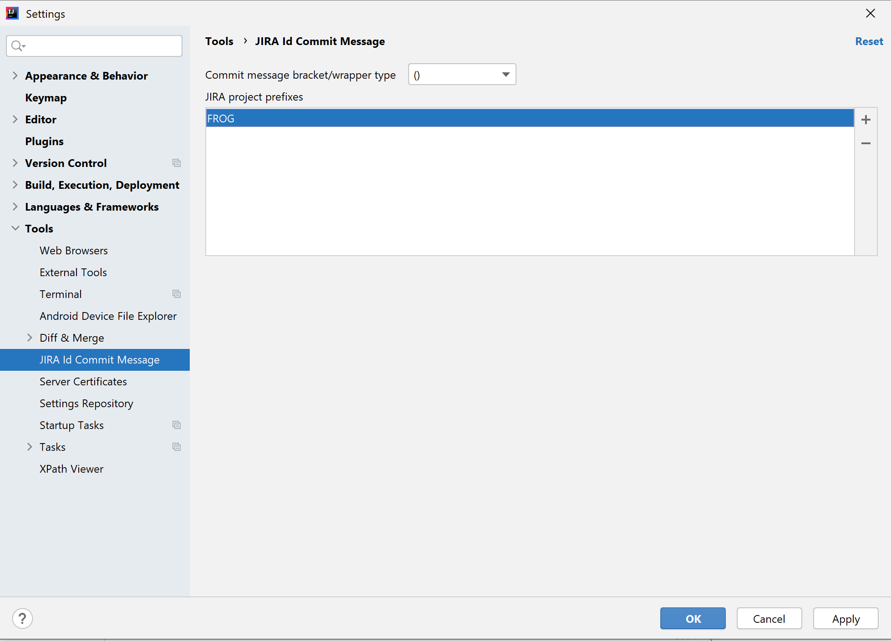
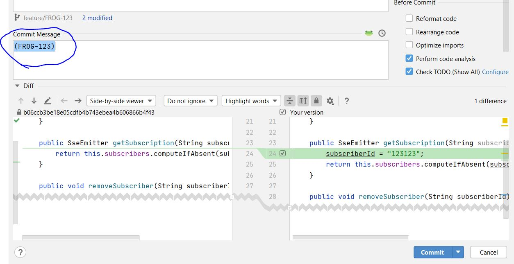

# jira-commit-message-intellij-plugin

Jira commit message plugin helps you by automatically appending JIRA task id to your commit messages.

<!-- Plugin description -->
A simple plugin that takes JIRA id from your branch name and appends it to the commit message.
<!-- Plugin description end -->

## Installation

- Using IDE built-in plugin system:
  
  <kbd>Preferences</kbd> > <kbd>Plugins</kbd> > <kbd>Marketplace</kbd> > <kbd>Search for "JIRA id commit message"</kbd> >
  <kbd>Install Plugin</kbd>
  
- Manually:

  Download the [latest release](https://github.com/nemwiz/jira-commit-message-intellij-plugin/releases/latest) and install it manually using
  <kbd>Preferences</kbd> > <kbd>Plugins</kbd> > <kbd>⚙️</kbd> > <kbd>Install plugin from disk...</kbd>

---

### Configuration options

JIRA project prefix - name of your JIRA project

### How to use the plugin

1. [Install the plugin](https://plugins.jetbrains.com/plugin/14310-jira-id-commit-message)
2. Go to File > Settings > Tools > JIRA Id Commit Message
3. Add your project prefix (e.g. your JIRA ticket is FROG-123, so your project prefix would be FROG)
   
(Optional) Commit message bracket/wrapper type - allows to customize the bracket or the wrapper for your commit message e.g. you can have a message like `(FROG-123)` or `{FROG-123}` etc.

4. Name your branches in one of the following format. Just an example :)
    > feature/FROG-123
    >
    > feature/FROG-123-whatever
    >
    > FROG-123
    >
    > FROG-123-whatever
    >
    > whatever/feature/FROG-123-whatever

5. Make some changes. When the "Commit changes" dialog is opened your commit message is **automatically** populated with JIRA id from the branch name.

6.(Optional) You can always regenerate the commit message by clicking on the frog icon.

Plugin based on the [IntelliJ Platform Plugin Template][template].

[template]: https://github.com/JetBrains/intellij-platform-plugin-template
